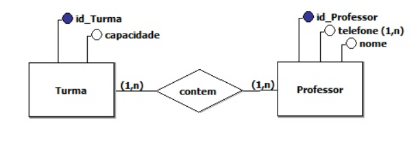
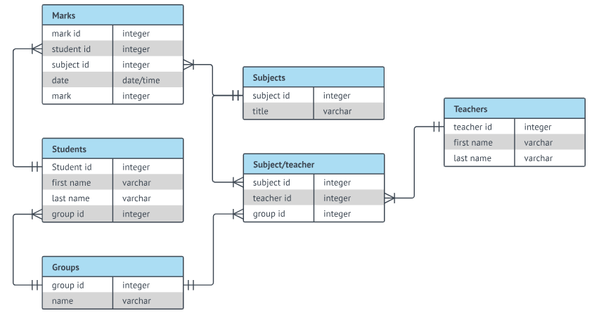

# 
 Banco de Dados
---

### 1. **Evolução e o Problema de Redundância**

Inicialmente as empresas tinham os dados informatizados por setores: vendas, produção, compras, de forma isolada. Isso gera rendundância de dados, ou seja, a mesma informação guardada em vários lugares.

### 2. **A solução: Banco de dados e SGBD**

Para resolver a reundância, surge o conceito de **Banco de Dados** : 
>um conjunto integrado de dados compartilhados por todos os setores

* **SGBD** - Sistema de Gerência de Banco de Dados: É o software que gerencia esses dados, permintindo criar, alterar e recuperar informações de forma eficiente e segura.

### 3. **Níveis de Abstração (Modelagem)**

Níveis diferentes para projetar um banco de dados:

* **DER - Modelo Conceitual** - Diagrama Entidade-Relacionamento:

É o "mapa" que os desenvolvedores olham para entender a estrutura. É um fluxograma visual utilizado para modelar a estrutura de um banco de dados, representando como os dados se relacionam entre si:

* **DER - Modelo Lógico**

Define "como" os dados serão organizados no software escolhido. Aqui é necessário compilar os requisitos de negócio e representar os requisitos como um modelo.

* **DER - Modelo Físico**

É a etapa final da modelagem de dados, traduzindo o diagrama lógico para tabelas concretas em um SGBD específico (MySQL, Oracle, PostgreSQL). Ele define tipos de dados (VARCHAR, INT), chaves primárias/estrangeiras, índices, restrições e, muitas vezes, requer desnormalização para performance. 

---

## Abordagem Entidade Relacionamento